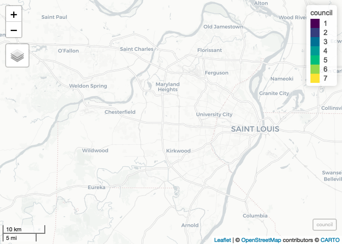
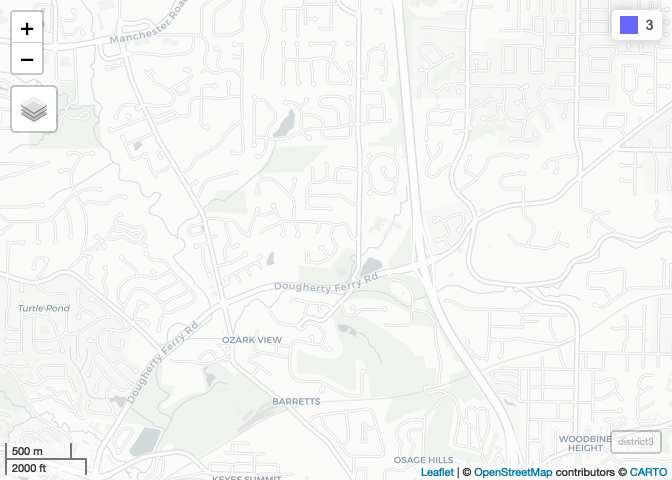

Lab-C Replication
================
Christopher Prener, Ph.D.
(March 22, 2021)

## Introduction

This notebook replicates the Lab-08 assignment.

## Dependencies

This notebook requires the following packages:

``` r
# tidyverse packages
library(dplyr)       # data wrangling tools
```

    ## 
    ## Attaching package: 'dplyr'

    ## The following objects are masked from 'package:stats':
    ## 
    ##     filter, lag

    ## The following objects are masked from 'package:base':
    ## 
    ##     intersect, setdiff, setequal, union

``` r
# spatial packages
library(nngeo)       # eliminate holes
```

    ## Loading required package: sf

    ## Linking to GEOS 3.8.1, GDAL 3.1.4, PROJ 6.3.1

``` r
library(mapview)     # preview spatial data
```

    ## GDAL version >= 3.1.0 | setting mapviewOptions(fgb = TRUE)

``` r
library(sf)          # spatial data tools

# other packages
library(here)        # file path management
```

    ## here() starts at /Users/chris/GitHub/slu-soc5650/content/module-3-dissolve/assignments/lab-08-replication

## Load Data

This notebook requires two shapefiles, one with precincts in
unincorporated parts of St. Louis County and one with precincts in
incorporated municipalities:

``` r
corp <- st_read(here("data", "STLC_ELECT_IncorporatedPrecincts"))
```

    ## Reading layer `STLC_ELECT_IncorporatedPrecincts' from data source `/Users/chris/GitHub/slu-soc5650/content/module-3-dissolve/assignments/lab-08-replication/data/STLC_ELECT_IncorporatedPrecincts' using driver `ESRI Shapefile'
    ## Simple feature collection with 1064 features and 4 fields
    ## geometry type:  POLYGON
    ## dimension:      XY
    ## bbox:           xmin: -90.73619 ymin: 38.46679 xmax: -90.1968 ymax: 38.83229
    ## geographic CRS: WGS 84

``` r
unincorp <- st_read(here("data", "STLC_ELECT_UnincorporatedPrecincts"))
```

    ## Reading layer `STLC_ELECT_UnincorporatedPrecincts' from data source `/Users/chris/GitHub/slu-soc5650/content/module-3-dissolve/assignments/lab-08-replication/data/STLC_ELECT_UnincorporatedPrecincts' using driver `ESRI Shapefile'
    ## Simple feature collection with 398 features and 5 fields
    ## geometry type:  MULTIPOLYGON
    ## dimension:      XY
    ## bbox:           xmin: -90.7356 ymin: 38.3878 xmax: -90.11739 ymax: 38.89174
    ## geographic CRS: WGS 84

## Part 1

### Question 1

First, we need to convert these into a projected coordinate system - I
can see in the output of `st_read()` that they are both in the WGS 1984
geographic coordinate system. I’ll use Missouri State Plane East:

``` r
corp <- st_transform(corp, crs = 3602)
unincorp <- st_transform(unincorp, crs = 3602)
```

### Question 2

There are three problems with the unincorporated data - the variable
names do not match the incorporated data, and the precinct ID column is
character (as opposed to numeric in the incorporated data). There is
also an extra column, `WARD`. We’ll rename the variables, remove WARD,
and then convert the precinct ID column to numeric. The goal is to make
the unincorporated data match the incorporated data:

``` r
unincorp %>%
  select(-WARD) %>%
  rename(
    id = PRECINCTID,
    precinct = PRECINCT,
    council = COUNTY_COU,
    muni = MUNI
  ) %>%
  mutate(id = as.numeric(id)) -> unincorp
```

Now we have two matching data frames that can be merged (or bound)
together.

### Question 3

To combine these together, we’ll use `rbind()`:

``` r
precincts <- rbind(corp, unincorp)
```

We now have a single data frame with all preincts.

### Question 4

Next, we need to visually inspect the `precincts` object to see if it is
a geometry collection or if it has polygons. If you look in the global
enviornment, you can see that `geometry:sfc_GEOMETRY` appears in the
`precincts` object. We’ll extract this to `"POLYGON"` before proceeding
with the dissolve.

``` r
precincts <- st_collection_extract(precincts, type = "POLYGON")
```

Now we have data prepared for a dissolve.

### Question 5

Next, we’ll combine all of the preincts together based on the council
district they fall into:

``` r
precincts %>%
  select(council) %>%
  group_by(council) %>%
  summarise() -> council
```

We’ll preview the changes using `mapview`:

``` r
mapview(council)
```

<!-- -->

We can see a variety of holes throughout most of the council districts.

### Question 6

In order to address these holes, we can use `st_remove_holes()` to
clean-up the output:

``` r
council <- st_remove_holes(council)
```

We’ll preview the changes using `mapview`:

``` r
mapview(council)
```

<!-- -->

### Question 7

Finally, we’ll create a 1000 meter buffer around the centroid for
Council District 3 by:

-   subsetting our observations down to just District 3, then
-   calculating a centroid, then
-   calculating a buffer

``` r
council %>%
  filter(council == 3) %>%
  st_centroid() %>%
  st_buffer(dis = 1000) -> district3
```

    ## Warning in st_centroid.sf(.): st_centroid assumes attributes are constant over
    ## geometries of x

We’ll preview the changes using `mapview`:

``` r
mapview(district3)
```

<!-- -->
