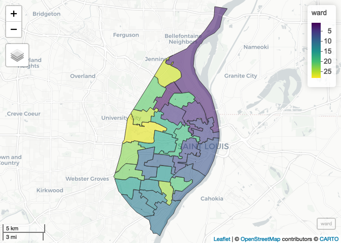
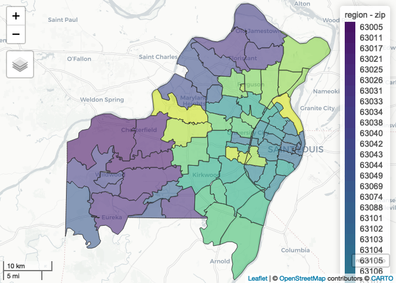

Lecture-C Example Notebook - Complete
================
Christopher Prener, Ph.D.
(April 20, 2020)

## Introduction

This notebook provides examples

## New Package

We need a new package, `nngeo`, that can be installed with the following
script:

``` r
# install.packages("nngeo")
```

## Dependencies

This notebook requires the following packages

``` r
# tidyverse packages
library(dplyr)    # data wrangling
```

    ## 
    ## Attaching package: 'dplyr'

    ## The following objects are masked from 'package:stats':
    ## 
    ##     filter, lag

    ## The following objects are masked from 'package:base':
    ## 
    ##     intersect, setdiff, setequal, union

``` r
# spatial packages
library(mapview)  # preview spatial data
library(nngeo)    # eliminiate holes
```

    ## Loading required package: sf

    ## Linking to GEOS 3.7.2, GDAL 2.4.2, PROJ 5.2.0

``` r
library(sf)       # spatial tools

# other packages
library(here)     # file path management
```

    ## here() starts at /Users/prenercg/GitHub/slu-soc5650/lecture-C

## Load Data

This notebook requires three files:

``` r
# precinct data
precinct <- st_read(here("data", "example-data", "POL_WRD_2010_Prec", "POL_WRD_2010_Prec.shp"), 
                    stringsAsFactors = FALSE) %>%
  st_transform(crs = 26915)
```

    ## Reading layer `POL_WRD_2010_Prec' from data source `/Users/prenercg/GitHub/slu-soc5650/lecture-C/data/example-data/POL_WRD_2010_Prec/POL_WRD_2010_Prec.shp' using driver `ESRI Shapefile'
    ## Simple feature collection with 233 features and 5 fields
    ## geometry type:  MULTIPOLYGON
    ## dimension:      XY
    ## bbox:           xmin: 871512.3 ymin: 982403 xmax: 915268.6 ymax: 1070966
    ## proj4string:    +proj=tmerc +lat_0=35.83333333333334 +lon_0=-90.5 +k=0.9999333333333333 +x_0=249999.9999999999 +y_0=0 +datum=NAD83 +units=us-ft +no_defs

``` r
# COVID zip code data
city <- st_read(here("data", "example-data", "daily_snapshot_stl_city.geojson"), 
                crs = 4326, stringsAsFactors = FALSE) %>%
  st_transform(crs = 26915)
```

    ## Reading layer `daily_snapshot_stl_city' from data source `/Users/prenercg/GitHub/slu-soc5650/lecture-C/data/example-data/daily_snapshot_stl_city.geojson' using driver `GeoJSON'
    ## Simple feature collection with 28 features and 11 fields
    ## geometry type:  MULTIPOLYGON
    ## dimension:      XY
    ## bbox:           xmin: -90.32052 ymin: 38.53185 xmax: -90.16657 ymax: 38.77443
    ## CRS:            EPSG:4326

``` r
county <- st_read(here("data", "example-data", "daily_snapshot_stl_county.geojson"), 
                  crs = 4326, stringsAsFactors = FALSE) %>%
  st_transform(crs = 26915)
```

    ## Reading layer `daily_snapshot_stl_county' from data source `/Users/prenercg/GitHub/slu-soc5650/lecture-C/data/example-data/daily_snapshot_stl_county.geojson' using driver `GeoJSON'
    ## Simple feature collection with 48 features and 11 fields
    ## geometry type:  MULTIPOLYGON
    ## dimension:      XY
    ## bbox:           xmin: -90.73653 ymin: 38.3883 xmax: -90.11771 ymax: 38.89118
    ## CRS:            EPSG:4326

## Dissolving Features

In our `preinct` data, we have a variable named `WARD10`. This is the
City Ward that each preinct falls within. If we wanted to map wards
instead of precincts, we can modify our geometric data using
`group_by()` and `summarise()`:

``` r
precinct %>%
  select(WARD10) %>%
  rename(ward = WARD10) %>%
  group_by(ward) %>%
  summarise() -> ward
```

Once these have been dissolved, we can explore them with `mapview()`:

``` r
mapview(ward)
```

<!-- -->

Notice how some wards, such as Ward 4 and Ward 21 in North City, Ward 6
and Ward 7 in Downtown, and Wards 12, 15, and 23 in South City have
“holes.” These are common artifacts of the dissolve process that
result from precincts’ geometries not *perfectly* abutting each other.

The `nngeo` package has a great function `st_remove_holes()` that can be
used to get rid of these:

``` r
ward <- st_remove_holes(ward)
```

We can check out the differences with `mapview()`:

``` r
mapview(ward)
```

<!-- -->

Be careful with removing holes, particularly if your features have
enclaves in them (as Kansas City does) - those enclaves will get removed
as well, and `st_difference()` will have to be used to cut the enclaves
back out\!

## Merging Features

Sometimes, we get data that we want to use in separate files, such as
the `city` and `county` COVID data (current as of 2020-04-19). We can
use `rbind()` to combine them.

``` r
region <- rbind(city, county)
```

Be sure to check them first to make sure they have the same names/types
of columns to prevent issues with your bound data\!

Once these have been merged, we can explore them with `mapview()`:

``` r
mapview(region, zcol = "zip")
```

<!-- -->

Notice that zip codes that lie along the city-county boundary are split.
We can use the dissolve features workflow to combine them\!

``` r
region %>%
  select(zip, confirmed) %>%
  group_by(zip) %>%
  summarise(confirmed = sum(confirmed, na.rm = TRUE)) -> region
```

Once these have been dissolved, we can explore them with
`mapview()`:

``` r
mapview(region, zcol = "zip")
```

<!-- -->

## Dealing with Geometry Collections

Sometimes when we geoprocess data, we get a mix of geometry types. This
occurs with the `region` data, where we get a mix of `"POLYGON"` and
`"MULTIPOLYGON"`
    features:

``` r
st_is(region, "POLYGON")
```

    ##  [1] FALSE FALSE FALSE FALSE FALSE FALSE FALSE FALSE FALSE FALSE FALSE FALSE
    ## [13] FALSE FALSE FALSE FALSE FALSE FALSE FALSE FALSE FALSE FALSE  TRUE FALSE
    ## [25] FALSE FALSE FALSE FALSE FALSE FALSE FALSE FALSE FALSE FALSE  TRUE FALSE
    ## [37]  TRUE  TRUE FALSE FALSE  TRUE FALSE  TRUE FALSE FALSE FALSE FALSE  TRUE
    ## [49] FALSE FALSE  TRUE FALSE FALSE  TRUE  TRUE FALSE FALSE FALSE FALSE  TRUE
    ## [61] FALSE FALSE  TRUE FALSE

This is known as a “geometry collection.” We can check the attributes of
the `geometry` column in `region` to confirm this:

``` r
attributes(region$geometry)$class
```

    ## [1] "sfc_GEOMETRY" "sfc"

We see `"sfc_GEOMETRY"` but expect either `"sfc_POLYGON"` or
`"sfc_MULTIPOLYGON"` instead. We can convert to polygon using:

``` r
region <- st_collection_extract(region, "POLYGON")
```

Once these have been merged, we can explore them with `mapview()`:

``` r
mapview(region, zcol = "zip")
```

<!-- -->
