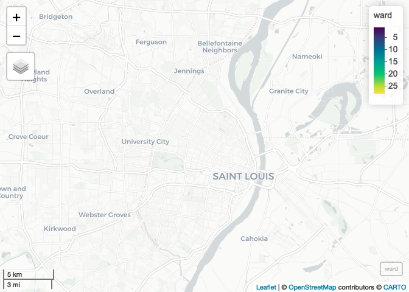
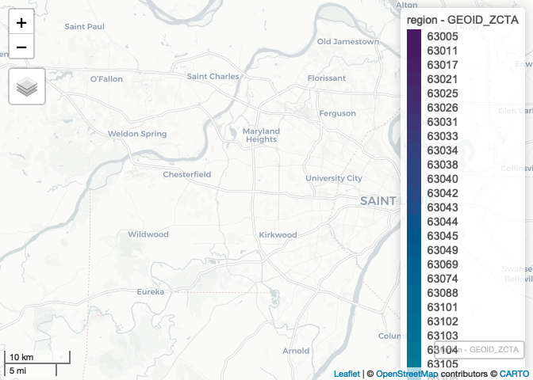
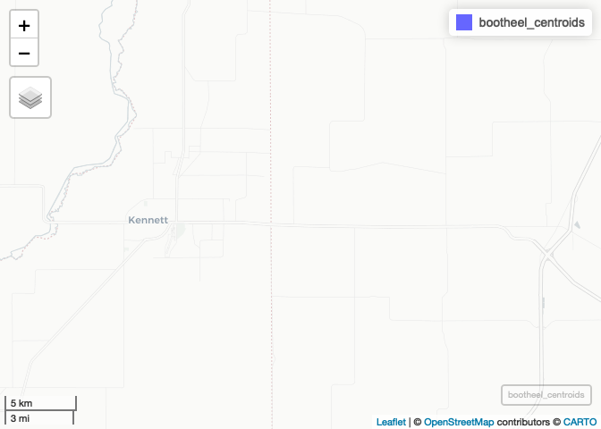
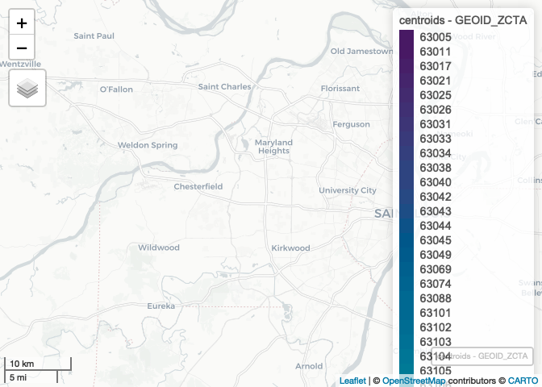
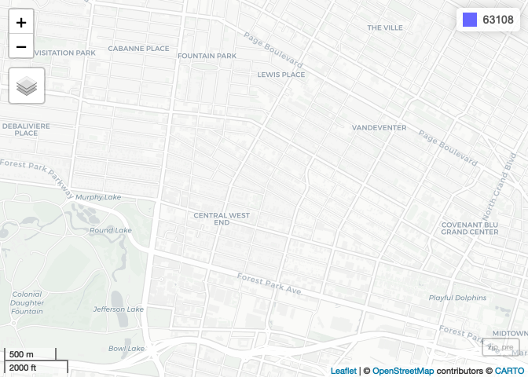
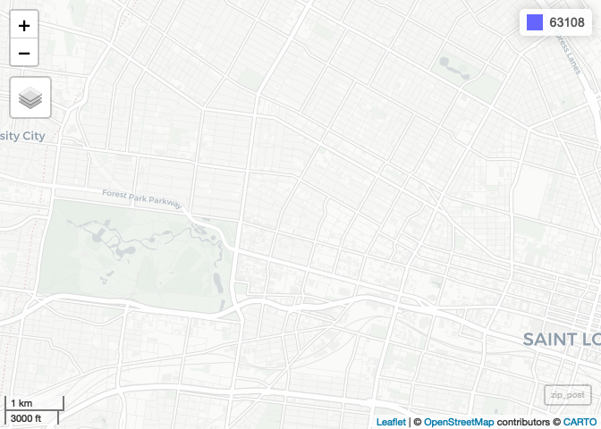

Meeting Notebook - Complete
================
Christopher Prener, Ph.D.
(March 22, 2021)

## Introduction

This notebook provides examples of binding data, dissolving features,
calculating centroids, and creating buffers.

## New Package

We need a new package, `nngeo`, that can be installed with the following
script:

``` r
install.packages("nngeo")
```

## Dependencies

This notebook requires the following packages

``` r
# tidyverse packages
library(dplyr)    # data wrangling
```

    ## 
    ## Attaching package: 'dplyr'

    ## The following objects are masked from 'package:stats':
    ## 
    ##     filter, lag

    ## The following objects are masked from 'package:base':
    ## 
    ##     intersect, setdiff, setequal, union

``` r
# spatial packages
library(mapview)  # preview spatial data
```

    ## GDAL version >= 3.1.0 | setting mapviewOptions(fgb = TRUE)

``` r
library(nngeo)    # eliminate holes
```

    ## Loading required package: sf

    ## Linking to GEOS 3.8.1, GDAL 3.1.4, PROJ 6.3.1

``` r
library(sf)       # spatial tools
library(tigris)   # TIGER/Line
```

    ## To enable 
    ## caching of data, set `options(tigris_use_cache = TRUE)` in your R script or .Rprofile.

``` r
# other packages
library(here)     # file path management
```

    ## here() starts at /Users/chris/GitHub/slu-soc5650/content/module-3-dissolve

## Load Data

This notebook requires three files:

``` r
# precinct data
precinct <- st_read(here("data", "example-data", "POL_WRD_2010_Prec", "POL_WRD_2010_Prec.shp"), 
                    stringsAsFactors = FALSE) %>%
  st_transform(crs = 3602)
```

    ## Reading layer `POL_WRD_2010_Prec' from data source `/Users/chris/GitHub/slu-soc5650/content/module-3-dissolve/data/example-data/POL_WRD_2010_Prec/POL_WRD_2010_Prec.shp' using driver `ESRI Shapefile'
    ## Simple feature collection with 233 features and 5 fields
    ## geometry type:  MULTIPOLYGON
    ## dimension:      XY
    ## bbox:           xmin: 871512.3 ymin: 982403 xmax: 915268.6 ymax: 1070966
    ## projected CRS:  Custom

``` r
# COVID zip code data
city <- st_read(here("data", "example-data", "daily_snapshot_stl_city.geojson"), 
                crs = 4326, stringsAsFactors = FALSE) %>%
  st_transform(crs = 3602) %>%
  mutate(GEOID_ZCTA = as.numeric(GEOID_ZCTA))
```

    ## Reading layer `daily_snapshot_stl_city' from data source `/Users/chris/GitHub/slu-soc5650/content/module-3-dissolve/data/example-data/daily_snapshot_stl_city.geojson' using driver `GeoJSON'
    ## Simple feature collection with 30 features and 10 fields
    ## geometry type:  MULTIPOLYGON
    ## dimension:      XY
    ## bbox:           xmin: -90.32052 ymin: 38.53185 xmax: -90.16657 ymax: 38.77443
    ## geographic CRS: WGS 84

``` r
county <- st_read(here("data", "example-data", "daily_snapshot_stl_county.geojson"), 
                  crs = 4326, stringsAsFactors = FALSE) %>%
  st_transform(crs = 3602)
```

    ## Reading layer `daily_snapshot_stl_county' from data source `/Users/chris/GitHub/slu-soc5650/content/module-3-dissolve/data/example-data/daily_snapshot_stl_county.geojson' using driver `GeoJSON'
    ## Simple feature collection with 49 features and 10 fields
    ## geometry type:  MULTIPOLYGON
    ## dimension:      XY
    ## bbox:           xmin: -90.73653 ymin: 38.3883 xmax: -90.11771 ymax: 38.89118
    ## geographic CRS: WGS 84

We’ll also get some data on the St. Louis City and County boundaries as
well as on Dunklin and Pemiscot counties in the Bootheel:

``` r
counties <- counties(state = 29) %>%
  filter(GEOID %in% c("29189", "29510")) %>%
  select(GEOID, NAMELSAD) %>%
  st_transform(crs = 3602)
```

    ##   |                                                                              |                                                                      |   0%  |                                                                              |                                                                      |   1%  |                                                                              |=                                                                     |   1%  |                                                                              |=                                                                     |   2%  |                                                                              |==                                                                    |   2%  |                                                                              |==                                                                    |   3%  |                                                                              |==                                                                    |   4%  |                                                                              |===                                                                   |   4%  |                                                                              |===                                                                   |   5%  |                                                                              |====                                                                  |   5%  |                                                                              |====                                                                  |   6%  |                                                                              |=====                                                                 |   6%  |                                                                              |=====                                                                 |   7%  |                                                                              |=====                                                                 |   8%  |                                                                              |======                                                                |   8%  |                                                                              |======                                                                |   9%  |                                                                              |=======                                                               |   9%  |                                                                              |=======                                                               |  10%  |                                                                              |=======                                                               |  11%  |                                                                              |========                                                              |  11%  |                                                                              |========                                                              |  12%  |                                                                              |=========                                                             |  12%  |                                                                              |=========                                                             |  13%  |                                                                              |=========                                                             |  14%  |                                                                              |==========                                                            |  14%  |                                                                              |==========                                                            |  15%  |                                                                              |===========                                                           |  15%  |                                                                              |===========                                                           |  16%  |                                                                              |============                                                          |  16%  |                                                                              |============                                                          |  17%  |                                                                              |============                                                          |  18%  |                                                                              |=============                                                         |  18%  |                                                                              |=============                                                         |  19%  |                                                                              |==============                                                        |  19%  |                                                                              |==============                                                        |  20%  |                                                                              |==============                                                        |  21%  |                                                                              |===============                                                       |  21%  |                                                                              |===============                                                       |  22%  |                                                                              |================                                                      |  22%  |                                                                              |================                                                      |  23%  |                                                                              |================                                                      |  24%  |                                                                              |=================                                                     |  24%  |                                                                              |=================                                                     |  25%  |                                                                              |==================                                                    |  25%  |                                                                              |==================                                                    |  26%  |                                                                              |===================                                                   |  26%  |                                                                              |===================                                                   |  27%  |                                                                              |===================                                                   |  28%  |                                                                              |====================                                                  |  28%  |                                                                              |====================                                                  |  29%  |                                                                              |=====================                                                 |  29%  |                                                                              |=====================                                                 |  30%  |                                                                              |=====================                                                 |  31%  |                                                                              |======================                                                |  31%  |                                                                              |======================                                                |  32%  |                                                                              |=======================                                               |  32%  |                                                                              |=======================                                               |  33%  |                                                                              |=======================                                               |  34%  |                                                                              |========================                                              |  34%  |                                                                              |========================                                              |  35%  |                                                                              |=========================                                             |  35%  |                                                                              |=========================                                             |  36%  |                                                                              |==========================                                            |  36%  |                                                                              |==========================                                            |  37%  |                                                                              |==========================                                            |  38%  |                                                                              |===========================                                           |  38%  |                                                                              |===========================                                           |  39%  |                                                                              |============================                                          |  39%  |                                                                              |============================                                          |  40%  |                                                                              |============================                                          |  41%  |                                                                              |=============================                                         |  41%  |                                                                              |=============================                                         |  42%  |                                                                              |==============================                                        |  42%  |                                                                              |==============================                                        |  43%  |                                                                              |==============================                                        |  44%  |                                                                              |===============================                                       |  44%  |                                                                              |===============================                                       |  45%  |                                                                              |================================                                      |  45%  |                                                                              |================================                                      |  46%  |                                                                              |=================================                                     |  46%  |                                                                              |=================================                                     |  47%  |                                                                              |=================================                                     |  48%  |                                                                              |==================================                                    |  48%  |                                                                              |==================================                                    |  49%  |                                                                              |===================================                                   |  49%  |                                                                              |===================================                                   |  50%  |                                                                              |===================================                                   |  51%  |                                                                              |====================================                                  |  51%  |                                                                              |====================================                                  |  52%  |                                                                              |=====================================                                 |  52%  |                                                                              |=====================================                                 |  53%  |                                                                              |=====================================                                 |  54%  |                                                                              |======================================                                |  54%  |                                                                              |======================================                                |  55%  |                                                                              |=======================================                               |  55%  |                                                                              |=======================================                               |  56%  |                                                                              |========================================                              |  56%  |                                                                              |========================================                              |  57%  |                                                                              |========================================                              |  58%  |                                                                              |=========================================                             |  58%  |                                                                              |=========================================                             |  59%  |                                                                              |==========================================                            |  59%  |                                                                              |==========================================                            |  60%  |                                                                              |==========================================                            |  61%  |                                                                              |===========================================                           |  61%  |                                                                              |===========================================                           |  62%  |                                                                              |============================================                          |  62%  |                                                                              |============================================                          |  63%  |                                                                              |============================================                          |  64%  |                                                                              |=============================================                         |  64%  |                                                                              |=============================================                         |  65%  |                                                                              |==============================================                        |  65%  |                                                                              |==============================================                        |  66%  |                                                                              |===============================================                       |  66%  |                                                                              |===============================================                       |  67%  |                                                                              |===============================================                       |  68%  |                                                                              |================================================                      |  68%  |                                                                              |================================================                      |  69%  |                                                                              |=================================================                     |  69%  |                                                                              |=================================================                     |  70%  |                                                                              |=================================================                     |  71%  |                                                                              |==================================================                    |  71%  |                                                                              |==================================================                    |  72%  |                                                                              |===================================================                   |  72%  |                                                                              |===================================================                   |  73%  |                                                                              |===================================================                   |  74%  |                                                                              |====================================================                  |  74%  |                                                                              |====================================================                  |  75%  |                                                                              |=====================================================                 |  75%  |                                                                              |=====================================================                 |  76%  |                                                                              |======================================================                |  76%  |                                                                              |======================================================                |  77%  |                                                                              |======================================================                |  78%  |                                                                              |=======================================================               |  78%  |                                                                              |=======================================================               |  79%  |                                                                              |========================================================              |  79%  |                                                                              |========================================================              |  80%  |                                                                              |========================================================              |  81%  |                                                                              |=========================================================             |  81%  |                                                                              |=========================================================             |  82%  |                                                                              |==========================================================            |  82%  |                                                                              |==========================================================            |  83%  |                                                                              |==========================================================            |  84%  |                                                                              |===========================================================           |  84%  |                                                                              |===========================================================           |  85%  |                                                                              |============================================================          |  85%  |                                                                              |============================================================          |  86%  |                                                                              |=============================================================         |  86%  |                                                                              |=============================================================         |  87%  |                                                                              |=============================================================         |  88%  |                                                                              |==============================================================        |  88%  |                                                                              |==============================================================        |  89%  |                                                                              |===============================================================       |  89%  |                                                                              |===============================================================       |  90%  |                                                                              |===============================================================       |  91%  |                                                                              |================================================================      |  91%  |                                                                              |================================================================      |  92%  |                                                                              |=================================================================     |  92%  |                                                                              |=================================================================     |  93%  |                                                                              |=================================================================     |  94%  |                                                                              |==================================================================    |  94%  |                                                                              |==================================================================    |  95%  |                                                                              |===================================================================   |  95%  |                                                                              |===================================================================   |  96%  |                                                                              |====================================================================  |  96%  |                                                                              |====================================================================  |  97%  |                                                                              |====================================================================  |  98%  |                                                                              |===================================================================== |  98%  |                                                                              |===================================================================== |  99%  |                                                                              |======================================================================|  99%  |                                                                              |======================================================================| 100%

``` r
bootheel <- counties(state = 29) %>%
  filter(GEOID %in% c("29069", "29155")) %>%
  select(GEOID, NAMELSAD) %>%
  st_transform(crs = 3602)
```

## Dissolving Features

In our `preinct` data, we have a variable named `WARD10`. This is the
City Ward that each precinct falls within. If we wanted to map wards
instead of precincts, we can modify our geometric data using
`group_by()` and `summarise()`:

``` r
precinct %>%
  select(WARD10) %>%
  rename(ward = WARD10) %>%
  group_by(ward) %>%
  summarise() -> ward
```

Once these have been dissolved, we can explore them with `mapview()`:

``` r
mapview(ward)
```

<!-- -->

Notice how some wards, such as Ward 4 and Ward 21 in North City, Ward 6
and Ward 7 in Downtown, and Wards 12, 15, and 23 in South City have
“holes.” These are common artifacts of the dissolve process that result
from precincts’ geometries not *perfectly* abutting each other.

The `nngeo` package has a great function `st_remove_holes()` that can be
used to get rid of these:

``` r
ward <- st_remove_holes(ward)
```

We can check out the differences with `mapview()`:

``` r
mapview(ward)
```

<!-- -->

Be careful with removing holes, particularly if your features have
enclaves in them (as Kansas City does) - those enclaves will get removed
as well, and `st_difference()` will have to be used to cut the enclaves
back out!

## Merging Features

Last week, we quickly introduced `rbind()` to combine `sf` objects. I
want to talk a bit more about that process today, and also connect it to
the dissolve workflow from above. Sometimes, we get data that we want to
use in separate files, such as the `city` and `county` COVID data
(current as of 2021-03-21). Be sure to check them first to make sure
they have the same names/types of columns to prevent issues with your
bound data:

``` r
str(city)
```

    ## Classes 'sf' and 'data.frame':   30 obs. of  11 variables:
    ##  $ GEOID_ZCTA   : num  63101 63102 63103 63104 63105 ...
    ##  $ report_date  : Date, format: "2021-03-21" "2021-03-21" ...
    ##  $ geoid        : chr  "29510" "29510" "29510" "29510" ...
    ##  $ county       : chr  "St. Louis City" "St. Louis City" "St. Louis City" "St. Louis City" ...
    ##  $ state        : chr  "Missouri" "Missouri" "Missouri" "Missouri" ...
    ##  $ cases        : num  269 197 652 1351 58 ...
    ##  $ new_cases    : num  0 0 0 0 0 0 0 0 0 0 ...
    ##  $ case_avg     : num  0.7143 0.1429 1.0714 1.2857 0.0714 ...
    ##  $ case_rate    : num  81.3 89.5 78.5 67.8 61.5 ...
    ##  $ case_avg_rate: num  2.16 0.649 1.29 0.646 0.757 ...
    ##  $ geometry     :sfc_MULTIPOLYGON of length 30; first list element: List of 2
    ##   ..$ :List of 1
    ##   .. ..$ : num [1:19, 1:2] 276815 276797 276808 276815 276819 ...
    ##   ..$ :List of 1
    ##   .. ..$ : num [1:135, 1:2] 276237 276267 276272 276281 276285 ...
    ##   ..- attr(*, "class")= chr [1:3] "XY" "MULTIPOLYGON" "sfg"
    ##  - attr(*, "sf_column")= chr "geometry"
    ##  - attr(*, "agr")= Factor w/ 3 levels "constant","aggregate",..: NA NA NA NA NA NA NA NA NA NA
    ##   ..- attr(*, "names")= chr [1:10] "GEOID_ZCTA" "report_date" "geoid" "county" ...

``` r
str(county)
```

    ## Classes 'sf' and 'data.frame':   49 obs. of  11 variables:
    ##  $ GEOID_ZCTA   : chr  "63005" "63011" "63017" "63021" ...
    ##  $ report_date  : Date, format: "2021-03-21" "2021-03-21" ...
    ##  $ geoid        : chr  "29189" "29189" "29189" "29189" ...
    ##  $ county       : chr  "St. Louis" "St. Louis" "St. Louis" "St. Louis" ...
    ##  $ state        : chr  "Missouri" "Missouri" "Missouri" "Missouri" ...
    ##  $ cases        : num  1747 3084 3765 4869 1453 ...
    ##  $ new_cases    : num  0 3 8 1 0 1 9 2 1 1 ...
    ##  $ case_avg     : num  2.5 4.07 5.07 6.43 3.36 ...
    ##  $ case_rate    : num  97.7 80.2 90.6 86.6 173.2 ...
    ##  $ case_avg_rate: num  1.4 1.06 1.22 1.14 4 ...
    ##  $ geometry     :sfc_MULTIPOLYGON of length 49; first list element: List of 1
    ##   ..$ :List of 1
    ##   .. ..$ : num [1:1239, 1:2] 229763 229765 229766 229769 229769 ...
    ##   ..- attr(*, "class")= chr [1:3] "XY" "MULTIPOLYGON" "sfg"
    ##  - attr(*, "sf_column")= chr "geometry"
    ##  - attr(*, "agr")= Factor w/ 3 levels "constant","aggregate",..: NA NA NA NA NA NA NA NA NA NA
    ##   ..- attr(*, "names")= chr [1:10] "GEOID_ZCTA" "report_date" "geoid" "county" ...

We’re looking for matching column types and a minimal number of needed
columns. For instance, I know that I’m going to get rid of everything
except the ZIP itself (`GEOID_ZCTA`) and the total count of cases. We
should also check to see if `GEOID_ZCTA` and `cases` are the same type
of data in both objects, and correct if they are not:

``` r
# city data
city %>%
  select(GEOID_ZCTA, cases) %>%
  mutate(GEOID_ZCTA = as.character(GEOID_ZCTA)) -> city

# county data
county <- select(county, GEOID_ZCTA, cases)
```

Once we feel confident with any changes that need to be made (using
`mutate()` and `select()`), we can use `rbind()` to combine them:

``` r
region <- rbind(city, county)
```

Once these have been merged, we can explore them with `mapview()`:

``` r
mapview(region, zcol = "GEOID_ZCTA")
```

<!-- -->

Notice that zip codes that lie along the city-county boundary are split.
We can use the dissolve features workflow to combine them!

``` r
region %>%
  select(GEOID_ZCTA, cases) %>%
  group_by(GEOID_ZCTA) %>%
  summarise(cases = sum(cases, na.rm = TRUE)) -> region
```

We also want to check to make sure these data are not in a geometry
collection. We see `"sfc_GEOMETRY"` but expect either `"sfc_POLYGON"` or
`"sfc_MULTIPOLYGON"` instead. We can convert to polygon using:

``` r
region <- st_collection_extract(region, "POLYGON")
```

Once these have been reformatted correctly, we can explore them with
`mapview()`:

``` r
mapview(region, zcol = "GEOID_ZCTA")
```

<!-- -->

## Centroids

Centroids are the geographic center of a feature. Take, for example,
these two counties (Dunklin and Pemiscot) in the very southeast corner
of Missouri - what we call the “Bootheel”:

``` r
mapview(bootheel)
```

<!-- -->

If we want to find the geographic center of both counties, we can
calculate their centroids:

``` r
bootheel_centroids <- st_centroid(bootheel)
```

    ## Warning in st_centroid.sf(bootheel): st_centroid assumes attributes are constant
    ## over geometries of x

Once we have those calculated, we can preview them to see how they’ve
changed:

``` r
mapview(bootheel_centroids)
```

<!-- -->

Take a look at the centroid for Dunklin County, which falls *just*
outside of the country boundary itself! In this case, the geographic
center of Dunklin County is not actually in Dunklin County because of
its distinctive shape. I love it! This is something to be aware of when
you’re geoprocessing your data. For example:

``` r
st_intersection(bootheel_centroids, bootheel)
```

    ## Warning: attribute variables are assumed to be spatially constant throughout all
    ## geometries

    ## Simple feature collection with 1 feature and 4 fields
    ## geometry type:  POINT
    ## dimension:      XY
    ## bbox:           xmin: 314251.3 ymin: 42176.97 xmax: 314251.3 ymax: 42176.97
    ## projected CRS:  NAD83(NSRS2007) / Missouri East
    ##   GEOID        NAMELSAD GEOID.1      NAMELSAD.1                  geometry
    ## 2 29155 Pemiscot County   29155 Pemiscot County POINT (314251.3 42176.97)

Notice how the centroid for Dunklin County isn’t returned!

### Example

Imagine we had not started out with county attributes in our ZIP code
data, but we wanted to know which ZIP codes fall in St. Louis City or
St. Louis County. This is tricky, because we don’t know (in this
hypothetical scenario) how many cases can be attributed to the city or
the county. One way to get a rough sense is to located ZIPs by where
their centroid falls. To do this, we’ll start by calculating centroids
for each ZIP:

``` r
# calculate
centroids <- st_centroid(region)
```

    ## Warning in st_centroid.sf(region): st_centroid assumes attributes are constant
    ## over geometries of x

Let’s take a look at how these data changed. First, we’ll check out
their structure:

``` r
str(centroids)
```

    ## sf [66 × 3] (S3: sf/tbl_df/tbl/data.frame)
    ##  $ GEOID_ZCTA: chr [1:66] "63005" "63011" "63017" "63021" ...
    ##  $ cases     : num [1:66] 1747 3084 3765 4869 1453 ...
    ##  $ geometry  :sfc_POINT of length 66; first list element:  'XY' num [1:2] 237183 311952
    ##  - attr(*, "sf_column")= chr "geometry"
    ##  - attr(*, "agr")= Factor w/ 3 levels "constant","aggregate",..: NA NA
    ##   ..- attr(*, "names")= chr [1:2] "GEOID_ZCTA" "cases"

Notice that they have the *exact same* attributes, but that their
geometry has become points. Let’s also map them:

``` r
mapview(centroids, zcol = "GEOID_ZCTA")
```

<!-- -->

One thing I look for are centroid that might actually fall outside of
the county itself. ZIP 63304 (along the Missouri River near
Chesterfield) stands out as a possibility here.

Next, we’ll label our zips with the centroid they fall in. To do this,
we’ll intersect our county polygons with the centroid values:

``` r
centroids <- st_intersection(centroids, counties)
```

    ## Warning: attribute variables are assumed to be spatially constant throughout all
    ## geometries

Notice that the number of observations doesn’t change, so we know that
all of the centroids fell within the tract boundaries. If we did lose a
county, how could we handle it?

We’ll preview them to get a sense of how the data have changed:

``` r
mapview(centroids, zcol = "GEOID_ZCTA")
```

<!-- -->

## Buffers

Finally, I want to illustrate calculating a buffer. For example, we
might want to get a count of crimes that fall within or near a ZIP code
in the City. We’ll extract 63108, the ZIP that SLU partially falls in,
and buffer around it:

``` r
# data cleaning
region %>%
  select(GEOID_ZCTA) %>%
  filter(GEOID_ZCTA == "63108") -> zip_pre

# calculate buffer
zip_post <- st_buffer(zip_pre, dis = 500)
```

The value `500` refers to 500 meters. We know it is meters based on the
coordinate system:

``` r
st_crs(zip_post)
```

    ## Coordinate Reference System:
    ##   User input: EPSG:3602 
    ##   wkt:
    ## PROJCRS["NAD83(NSRS2007) / Missouri East",
    ##     BASEGEOGCRS["NAD83(NSRS2007)",
    ##         DATUM["NAD83 (National Spatial Reference System 2007)",
    ##             ELLIPSOID["GRS 1980",6378137,298.257222101,
    ##                 LENGTHUNIT["metre",1]]],
    ##         PRIMEM["Greenwich",0,
    ##             ANGLEUNIT["degree",0.0174532925199433]],
    ##         ID["EPSG",4759]],
    ##     CONVERSION["SPCS83 Missouri East zone (meters)",
    ##         METHOD["Transverse Mercator",
    ##             ID["EPSG",9807]],
    ##         PARAMETER["Latitude of natural origin",35.8333333333333,
    ##             ANGLEUNIT["degree",0.0174532925199433],
    ##             ID["EPSG",8801]],
    ##         PARAMETER["Longitude of natural origin",-90.5,
    ##             ANGLEUNIT["degree",0.0174532925199433],
    ##             ID["EPSG",8802]],
    ##         PARAMETER["Scale factor at natural origin",0.999933333,
    ##             SCALEUNIT["unity",1],
    ##             ID["EPSG",8805]],
    ##         PARAMETER["False easting",250000,
    ##             LENGTHUNIT["metre",1],
    ##             ID["EPSG",8806]],
    ##         PARAMETER["False northing",0,
    ##             LENGTHUNIT["metre",1],
    ##             ID["EPSG",8807]]],
    ##     CS[Cartesian,2],
    ##         AXIS["easting (X)",east,
    ##             ORDER[1],
    ##             LENGTHUNIT["metre",1]],
    ##         AXIS["northing (Y)",north,
    ##             ORDER[2],
    ##             LENGTHUNIT["metre",1]],
    ##     USAGE[
    ##         SCOPE["unknown"],
    ##         AREA["USA - Missouri - SPCS - E"],
    ##         BBOX[35.98,-91.97,40.61,-89.1]],
    ##     ID["EPSG",3602]]

We’ll preview the initial zip first, and then preview the change:

``` r
mapview(zip_pre)
```

<!-- -->

``` r
mapview(zip_post)
```

<!-- -->
